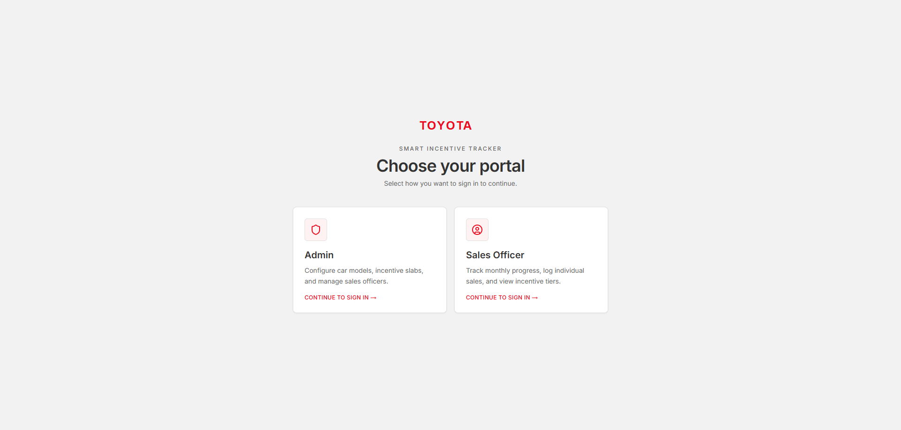
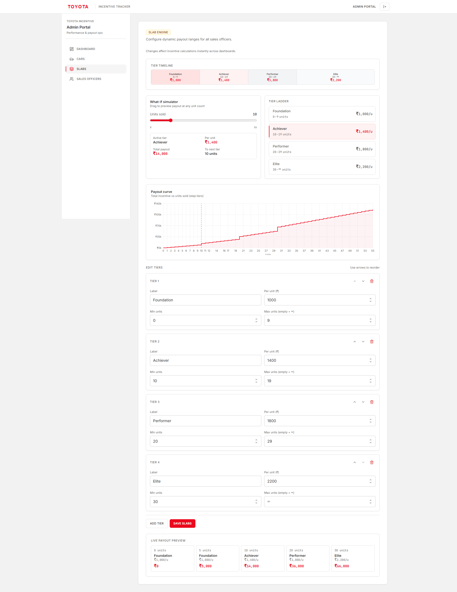
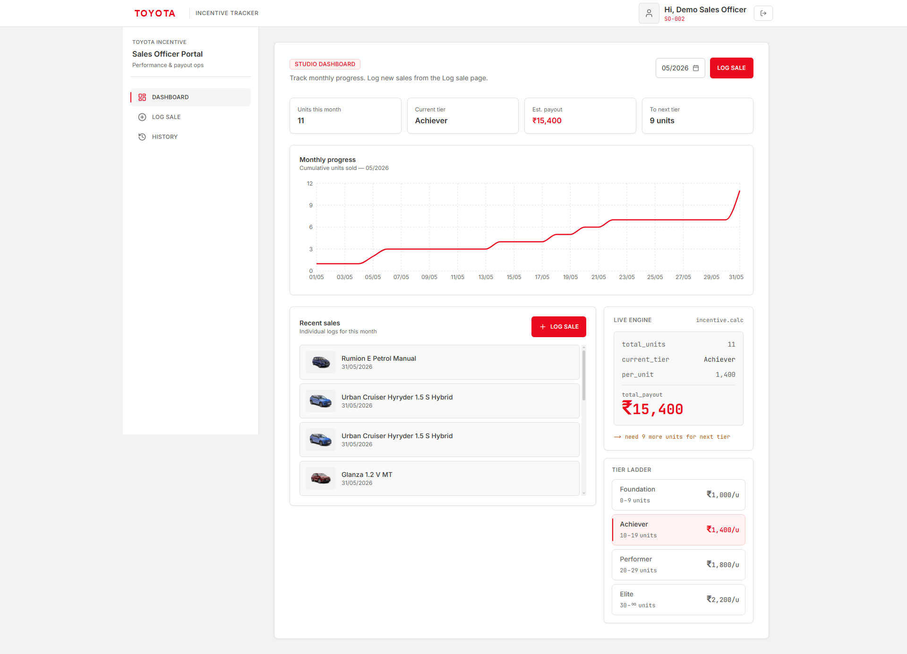
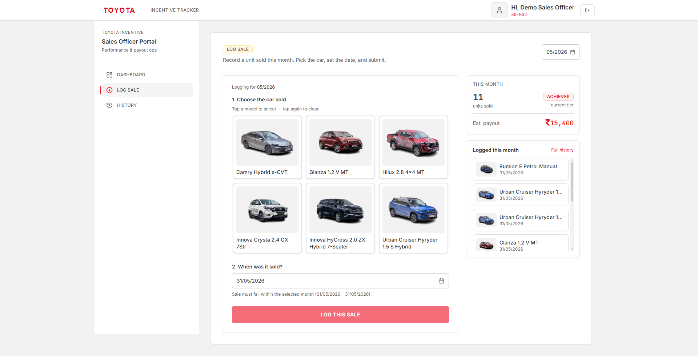

# Toyota Smart Incentive Tracker

**Task 2 submission, Smart Incentive Calculator with Dynamic Slab Admin Panel**  
**Nippon Toyota, SDE Internship Round 2**

A web app where **admins** configure Toyota car models and incentive payout slabs, and **sales officers** log monthly sales and see their tier + estimated payout update in real time.

| | |
|---|---|
| **Live app** | https://toyota-smart-incentive-tracker.vercel.app |
| **GitHub** | https://github.com/Krishnanand-G/Toyota_Smart_Incentive_Tracker |
| **Author** | Krishnanand G — B.Tech CSE, 2026 |

---

## How this maps to the task

### Role A — Admin Portal (configuration engine)

| Requirement | What I built |
|---|---|
| Car inventory (add / edit / delete) | `/admin/cars` — model name, base suffix, variant, image |
| Dynamic slab engine | `/admin/slabs` — tiered ranges with ₹ per unit, drag/reorder style panel |
| Update ranges anytime | Saved to PostgreSQL; officer dashboards pick up new slabs |
| Clean admin dashboard | `/admin` — stats, charts, officer leaderboard |

### Role B — Sales Officer Portal (calculation dashboard)

| Requirement | What I built |
|---|---|
| Secure login | Separate pages: `/login/admin` and `/login/officer` (RBAC) |
| Select month + log sales per model | `/officer/log-sale` — pick car, set date, log each sale |
| Real-time tracker | `/officer` — live tier, payout estimate, progress chart, tier ladder |
| Monthly history | `/officer/history` — past months with per-sale breakdown |

---

## Tech stack

- **Frontend:** Next.js 14, React, TypeScript, Tailwind CSS
- **Backend:** Next.js API routes
- **Database:** PostgreSQL (Supabase) + Prisma ORM
- **Auth:** Supabase Auth + app-level roles in the database
- **Charts:** Recharts
- **Deploy:** Vercel
- **Storage:** Supabase Storage (officer profile photos on live site)

---

## Screenshots

Add PNG/JPG files under `docs/screenshots/` and they will show up here.

| # | File name (suggested) | What to capture |
|---|---|---|
| 1 | `01-home-portal.png` | Home page — Admin vs Officer portal choice |
| 2 | `02-admin-login.png` | Admin login page |
| 3 | `03-admin-dashboard.png` | Admin dashboard with metrics / charts |
| 4 | `04-admin-cars.png` | Car inventory — add/edit car models |
| 5 | `05-admin-slabs.png` | **Important** — Dynamic slab panel with tier ranges and ₹/unit |
| 6 | `06-admin-officers.png` | Sales officer management list |
| 7 | `07-officer-login.png` | Officer login page |
| 8 | `08-officer-dashboard.png` | **Important** — Officer dashboard: tier, payout, chart, tier ladder |
| 9 | `09-officer-log-sale.png` | **Important** — Logging a sale (car picker + date) |
| 10 | `10-officer-history.png` | Monthly history expanded with individual sales |
| 11 | `11-mobile-officer.png` | Same officer screen on **phone width** (proves responsive UI) |

### Preview (replace paths after you add files)







**Tip:** Use your **production URL** (`toyota-smart-incentive-tracker.vercel.app`), not preview deploy links. Hide demo passwords in screenshots if you can.

---

## Demo login (live site)

Create matching users in **Supabase Auth** and the app database (see setup below).

| Role | URL | Email (seed default) |
|---|---|---|
| Admin | `/login/admin` | `admin@toyota.local` |
| Officer | `/login/officer` | `officer@toyota.local` or `krishnanand.g@toyota.local` |

Password = whatever you set in Supabase Auth when creating the user.

On the live site, demo hints show if `NEXT_PUBLIC_SHOW_DEMO_CREDENTIALS=true` is set on Vercel.

---

## Incentive logic (short explanation)

Slabs are stored in the **`IncentiveSlab`** table. Example default tiers:

| Units sold (month) | Tier | ₹ per car |
|---|---|---|
| 0–9 | Foundation | 1,000 |
| 10–19 | Achiever | 1,400 |
| 20–29 | Performer | 1,800 |
| 30+ | Elite | 2,200 |

When an officer logs a sale, the app counts **total units that month**, finds the matching slab, and calculates payout. The same helper (`src/lib/incentive.ts`) is used on admin and officer pages so numbers stay consistent.

---

## Database schema (persistence)

PostgreSQL via Prisma:

| Table | Purpose |
|---|---|
| `User` | Admins & officers — email, role, officer ID, photo |
| `CarModel` | Sellable Toyota models |
| `IncentiveSlab` | Admin-defined tier ranges + payout rates |
| `SaleEntry` | Each logged sale (officer, car, date) |
| `MonthlySale` / `MonthlySaleItem` | Monthly summary structures |

Auth passwords live in **Supabase Auth**. App roles and business data live in **PostgreSQL**.

---

## Project structure

```
src/app/              Pages + API routes (/api/admin, /api/officer, /api/auth)
src/components/       UI (admin panels, officer dashboard, glass design system)
src/lib/              Incentive math, auth, validations, data loaders
prisma/               schema.prisma, migrations, seed.ts
docs/screenshots/     Put submission screenshots here
```

---

## Run locally

1. Clone the repo  
2. Copy `.env.example` → `.env` and fill in:
   - `DATABASE_URL`
   - `NEXT_PUBLIC_SUPABASE_URL`
   - `NEXT_PUBLIC_SUPABASE_ANON_KEY`
   - `SUPABASE_SERVICE_ROLE_KEY`

3. Install and set up:

```bash
npm install
npm run prisma:migrate
npm run prisma:seed
npm run dev
```

4. Open http://localhost:3000  
5. Create the same emails in **Supabase → Authentication → Users**

---

## Deploy (Vercel + Supabase)

1. Push to GitHub → import on Vercel  
2. Add all env vars from `.env`  
3. Use Supabase **Transaction pooler** for `DATABASE_URL` (port **6543**) and append `?pgbouncer=true`  
4. On your machine, run against production DB:

```bash
npm run db:deploy
npm run prisma:seed
```

5. Supabase → **Authentication → URL Configuration** — add your `.vercel.app` URL + `http://localhost:3000`

---

## Useful commands

```bash
npm run dev            # local dev server
npm run build          # production build check
npm run lint           # ESLint
npm run db:deploy      # apply migrations to remote DB
npm run prisma:seed    # demo cars, slabs, users, sample sales
```

---

## Notes for reviewers

- **RBAC:** Admins cannot access `/officer` routes and vice versa (middleware + role checks).
- **Errors:** API routes return JSON errors instead of crashing silently.
- **Responsive:** Mobile layouts use grids and collapsible sections (slabs, history, tier ladder).
- **Deployment:** Live URL tested for login, log sale, history, admin slab edits, and car CRUD.

---

Built by **Krishnanand G** for the Nippon Toyota SDE internship task.
