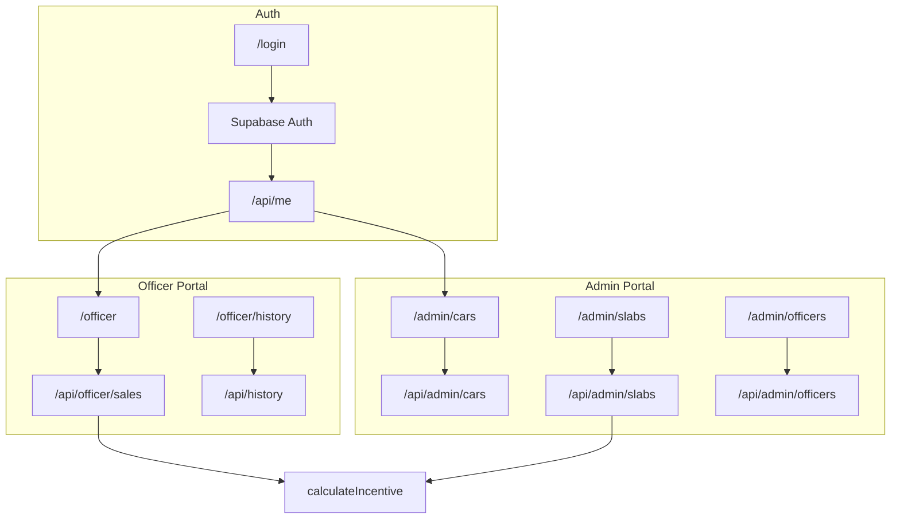

# Toyota Smart Incentive Tracker

Production-style Toyota incentive tracking app with role-based auth, admin configuration engine, dynamic slab payouts, and a real-time officer calculation dashboard.

**Live URL:** _Add your Vercel deployment URL here_

## Stack

- Next.js 14 (App Router) + TypeScript
- Tailwind CSS + dark Cursor-inspired design system
- Framer Motion (UI polish)
- Supabase Auth (`@supabase/ssr`)
- Prisma ORM + PostgreSQL

## Features

| Role | Capabilities |
|------|----------------|
| **Admin** | Car inventory CRUD, dynamic slab engine, officer management |
| **Officer** | Monthly volume entry, **live** incentive tracker, draft/save/submit, history |

- Secure role routing for `ADMIN` and `OFFICER`
- Real-time payout calculation as volumes change (shared `calculateIncentive` logic)
- Admin slab editor with tier cards and live preview probes
- Officer/admin history APIs and views

## Architecture



## Environment Setup

1. Copy `.env.example` to `.env`
2. Set:
   - `DATABASE_URL` — PostgreSQL connection string
   - `NEXT_PUBLIC_SUPABASE_URL`
   - `NEXT_PUBLIC_SUPABASE_ANON_KEY`

## Local Development

```bash
npm install
npm run prisma:migrate
npm run prisma:seed
npm run dev
```

App starts at [http://localhost:3000](http://localhost:3000).

## Demo Accounts (Seed Data)

Prisma seed creates these profiles. **You must also create matching users in Supabase Auth** (Authentication → Users) with the same emails and passwords:

| Role | Email | Notes |
|------|-------|-------|
| Admin | `admin@toyota.local` | Redirects to `/admin` |
| Officer | `officer@toyota.local` | Redirects to `/officer` |

On first login, the app links Supabase `authId` to the Prisma user by email if they differ.

## Pre-Submit Checklist

```bash
npm run lint
npm run build
```

Test responsive layouts at **375px**, **768px**, and **1280px** on login, officer dashboard, and admin slabs.

## Deployment (Vercel)

1. Push to GitHub and import the repo in Vercel
2. Add environment variables from `.env.example`
3. Run migrations against production DB **before** first deploy:

   ```bash
   npm run db:deploy
   npm run prisma:seed   # optional, for demo data
   ```

4. Deploy — `postinstall` runs `prisma generate` automatically
5. Add your live URL at the top of this README

### Vercel env vars

| Variable | Required |
|----------|----------|
| `DATABASE_URL` | Yes |
| `NEXT_PUBLIC_SUPABASE_URL` | Yes |
| `NEXT_PUBLIC_SUPABASE_ANON_KEY` | Yes |

## Screenshots

_Add screenshots here after deploy:_

1. Login page (dark theme)
2. Admin — Slab Engine with tier cards
3. Officer — Live tracker + tier ladder

## Useful Commands

```bash
npm run dev
npm run lint
npm run build
npm run db:deploy
npm run prisma:migrate
npm run prisma:seed
```

## Project Structure

```
src/
  app/           # Routes (admin, officer, login, API)
  components/
    glass/       # Design system primitives
    incentive/   # LiveTracker, TierLadder, SlabCard
    layout/      # Portal shell, sidebar, top bar
  lib/
    incentive.ts # Shared slab calculation
    auth.ts      # Supabase + Prisma profile bridge
```
